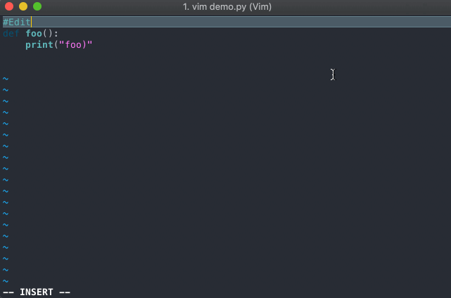

# vim-dublin-transport
Vim plugin to get real time information for Dublin Bus, Irish Rail and Luas. At the moment, it only supports Dublin Bus real time information with the intent to add support for Irish Rail and Luas in the future.

## Installation
Install using a vim plugin manager of choice; to install using Vundle (https://github.com/VundleVim/Vundle.vim assuming you have installed already) add `Plugin 'bobbymcgonigle/vim-dublin-transport'` to your .vimrc and use the `:PluginInstall` command.
## Commands

These are the basic commands that the plugin supports so far. More will be added over time.

|   .vimrc Requirements            |Command                          |Result                         |
|----------------|-------------------------------|-----------------------------|
|g:FavouriteBusStop
g:FavouriteBusRoute|`:Bus`|The the next favourite buses at your favourite stop, ideal for coming home from work               |
||`:NextBus <stopNumber> <busNumber>`|Lists the next buses of a inputted route at the inputted stop            |
|          |`:Stop <stopNumber>`|Lists real time info of all bus routes at that stop|

# Example .vimrc setup
Put the following two lines in you .vimrc file, this can be located by doing the vim command `:e $MYVIMRC`
>let g:FavouriteBusStop = 46 
let g:FavouriteBusRoute = 1

This allows you to do the `:Bus` command in vim which would produce an output like: 
>Next buses at stop: 46 
>1 in 9 minutes 
>1 in 29 minutes 
>1 in 49 minutes
